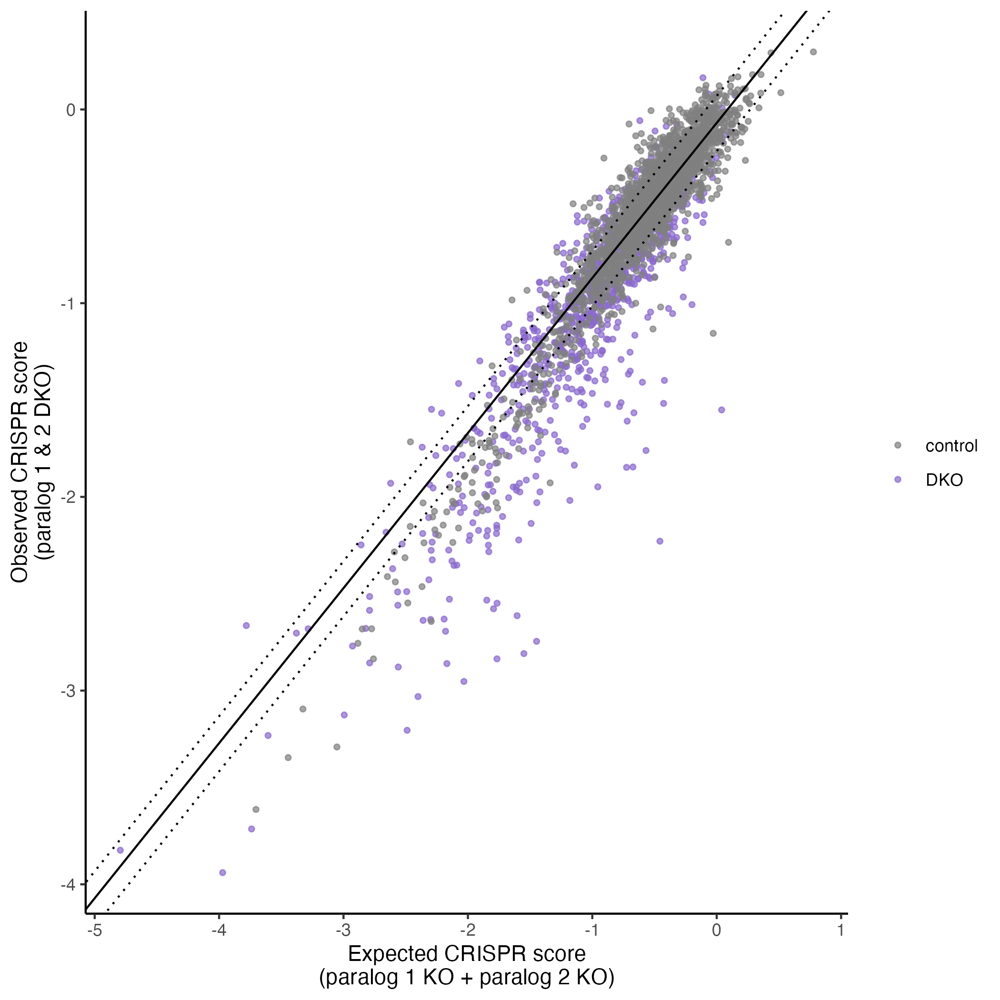
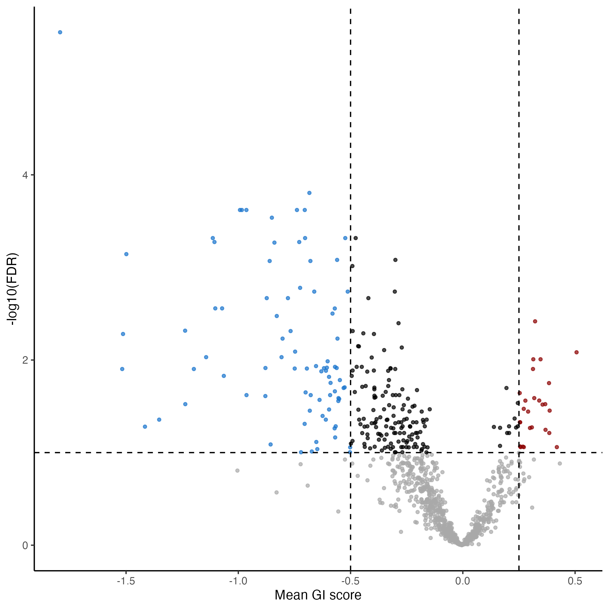
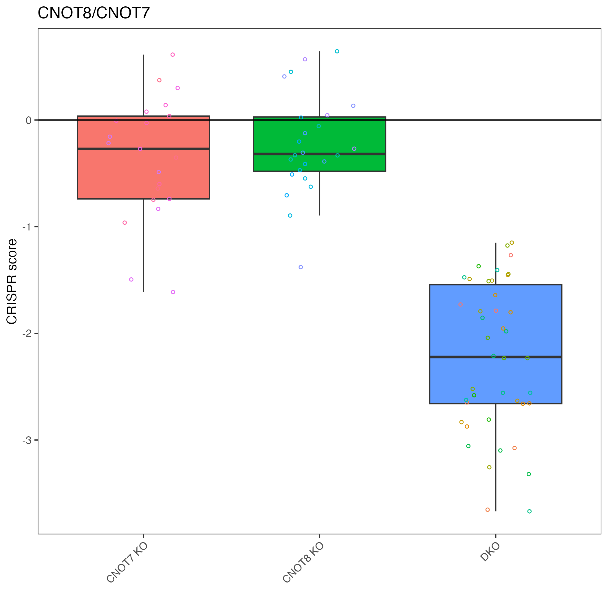

# Summary

The gimap (Genetic Interaction MAPping) R package addresses a fundamental challenge in genomic research: the difficulty of understanding gene function when backup copies exist. Gene redundancy makes traditional single-gene knockout methods ineffective for identifying therapeutic targets, as backup genes can mask the effects when a single gene is disabled. gimap offers a solution by providing a comprehensive framework for analyzing dual-target CRISPR screening data, where two genes are simultaneously disabled to reveal their backup relationships. The package processes raw count data through a multi-step pipeline that includes normalization, calculation of expected and observed CRISPR scores, computation of genetic interaction scores, and statistical analysis to identify significant interactions. Unlike general  tools, gimap is specifically tailored for paired guide CRISPR data with built-in quality control reporting and visualization tools. The package makes best practices the default options and is available on GitHub with comprehensive documentation to support the research community in extracting meaningful insights from complex genetic screening experiments.

# Statement of Need

When genes have backup copies in our genome, a common result of evolutionary processes, it becomes challenging to understand their true functions [citation suggestion?]. This redundancy makes it hard to identify effective therapeutic targets using traditional methods that disable just one gene at a time [citation suggestion?]. A more effective approach involves disabling two genes simultaneously to reveal these backup relationships [@thompson_combinatorial_2021].

Recent advances in CRISPR technology now allow researchers to knock out gene pairs at once, offering a powerful solution to this problem [citation suggestion?]. Although software solutions exist for single knockout CRISPR software methods exist, such as MAGeCK, there is no standardized software solution for paired gene CRISPR studies [@mageck].

R package called `gimap` (Genetic Interaction MAPping) was developed specifically for analyzing these dual-target CRISPR experiments. It helps researchers identify important relationships between genes, such as when two genes work together or when disabling both creates a dramatic effect that wouldn't occur by disabling either one alone.

`gimap` is specifically tailored to handle the unique characteristics of paired guide CRISPR data, including the distinction between single-targeting and double-targeting constructs and the need to account for differential double-strand break effects. The package seamlessly integrates with data generated using a specialized pgPEN library but can be adapted for any paired-guide CRISPR screening approach [@parrish_discovery_2021].

# Implementation

`gimap` addresses this need by providing a comprehensive analytical framework for dual-target CRISPR screening data. The package performs several critical functions: (1) normalization of read count data to account for variable sequencing depth and technical biases, (2) calculation of CRISPR scores that reflect the effect of gene knockouts on cell proliferation, (3) determination of expected CRISPR scores for gene pairs based on single-gene effects, (4) computation of genetic interaction scores that quantify deviations from expected effects, and (5) statistical analysis to identify significant interactions.

## Overall design philosophy

In order to ensure usability for the research community we built `gimap` using the following design philosophy.

1. Making best practices are default options and including warning messages for when alternative options are chose (e.g. if filtering has not been applied).  
2. We also tried to mimic usage elements from familiar packages such as fastqc reports (our `run_qc()` function creates such a report) [@fastqc].
3. Try to document and inform users of the statistics and decisions that have been made by the software clearly!

## gimap data handling

`gimap` implements a multi-step analysis pipeline:

1. **Normalization**: Raw count data is transformed into log2 counts per million (CPM) and adjusted by subtracting pre-treatment values to obtain log2 fold changes. These are further normalized based on the distribution of negative and positive controls.

2. **Expected Score Calculation**: For double-targeting constructs, expected CRISPR scores are calculated as the sum of the corresponding single-targeting scores. For single-targeting constructs, the expected score combines the single-target effect with the mean effect of control constructs.

3. **Genetic Interaction Scoring**: Interaction scores represent the difference between observed and expected CRISPR scores, adjusted using a linear model to account for systematic biases:
   ```
   GI score = observed score - (intercept + slope × expected score)
   ```

4. **Statistical Analysis**: T-tests compare the distribution of double-targeting genetic interaction scores against the background distribution of single-targeting scores, with false discovery rate correction for multiple hypothesis testing.

The package provides comprehensive visualization tools including volcano plots to highlight significant genetic interactions and detailed result tables for further analysis.

# Use Cases

`gimap` has been successfully used to identify synthetic lethal interactions among paralog genes in cancer cell lines, revealing potential therapeutic targets where single-gene approaches have failed. The package accommodates various experimental designs, including time-course studies and treatment comparisons, offering flexibility for diverse research questions.

_Example applications include:_  
- Identification of backup genes that provide functional redundancy in critical cellular pathways  
- Discovery of context-dependent genetic interactions that emerge under specific conditions or treatments  
- Systematic mapping of gene networks based on functional interactions rather than physical associations  

## Example usage

Here's an example workflow as can be called by the user.

### Set Up

Where `counts` is a matrix, `pg_ids` is ids for the constructs and corresponds to the rows of the `counts` data. Where `sample_metadata` is information that corresponds to the columns of the `counts` data.
```
gimap_dataset <- setup_data(
  counts,
  pg_ids,
  sample_metadata
)
```

### Run quality control check report

It is highly encouraged but not required that users run quality control. The `run_qc()` function creates an html report. See here for an [example report](https://fredhutch.github.io/gimap/articles/example_qc_report.html).

```
run_qc(gimap_dataset)
```

### Run the main workflow

As described above, this code implements the core of the workflow. Each have their own parameters that users can decide on using our tutorials and examples.
```
gimap_dataset <- gimap_dataset %>%
  gimap_filter() %>%
  gimap_annotate(cell_line = "HELA") %>%
  gimap_normalize(
    timepoints = "day"
  ) %>%
  calc_gi()
```

### Standardized visualizations

The `gimap` package also includes wrapped plotting functions so that after the data have been processed with this workflow

A plot showing the expected and observed CRISPR scores and the associated linear model can be made using:  `plot_exp_v_obs_scatter(gimap_dataset)`. The distance from each point to the linear model illustrated the GI score.



A volcano plot summarizing the results the target pairs can be created using: `plot_volcano(gimap_dataset)`



Individual target pairs like the gene pair CNOT7 and CNOT8 can be plotted using: `plot_targets(gimap_dataset, target1 = "CNOT8", target2 = "CNOT7")`


# Conclusion

`gimap` provides a robust, accessible framework for analyzing paired guide CRISPR screening data and identifying genetic interactions with potential biological and therapeutic significance. By streamlining the computational workflow from raw counts to statistically rigorous interaction scores, `gimap` enables researchers to efficiently extract meaningful insights from complex genetic screening experiments. The package is available on GitHub (https://github.com/FredHutch/gimap) with comprehensive documentation and tutorials to facilitate adoption by the research community.

# Acknowledgements

This work is funded by NCI grant R01CA262556 and the Translational Data Science IRC of Fred Hutchinson Cancer Center.

# References
