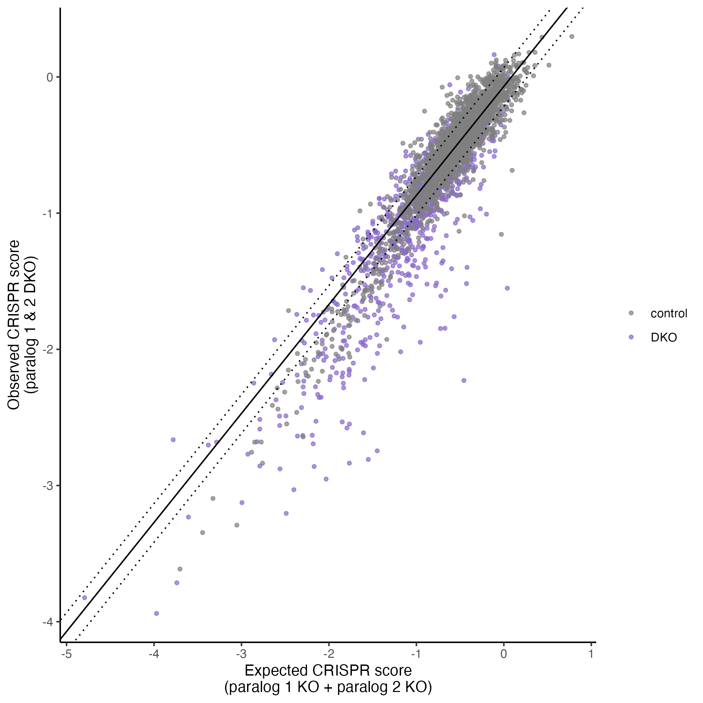
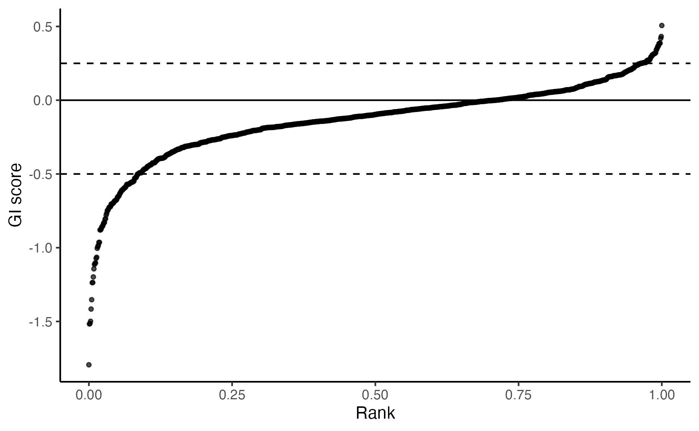
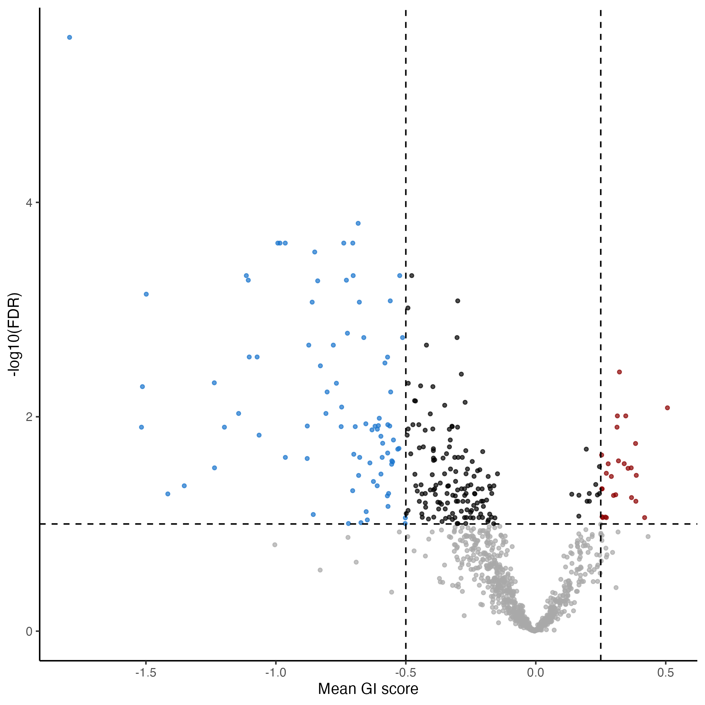
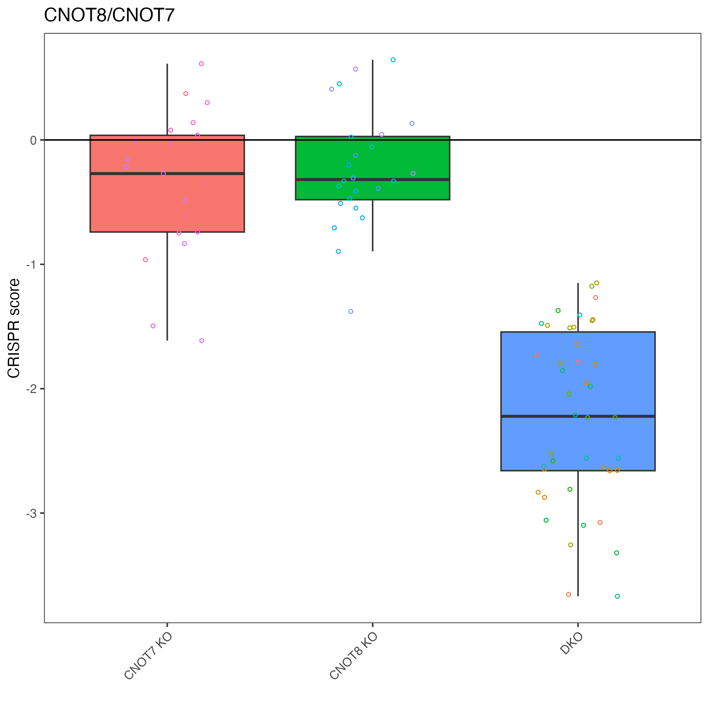

```{r, include = FALSE}
knitr::opts_chunk$set(
  collapse = TRUE,
  comment = "#>"
)
```

# Quick Start for gimap

For more background on gimap and the calculations done here, [read here](https://github.com/FredHutch/gimap/blob/main/README.md).

## About this example

This Quick Start walks through a dual-targeting (paired-guide) CRISPR screen
from start to finish using a small example dataset bundled through Figshare.

**Study design of the example data.** The counts come from a paralog genetic
interaction screen in HeLa cells using the pgPEN (paired guide RNAs for
paralog genetic interaction mapping) library. Cells expressing Cas9 are
transduced with a pooled library of paired-guide RNAs (pgRNAs) that knock out
either one gene (single-target constructs, paired with a non-targeting
control) or two paralogous genes simultaneously (double-target constructs).
Cells are collected at a baseline timepoint (Day 0, representing the library
composition before selection) and again after growth selection (Day 22),
with three biological replicates at the later timepoint. Changes in pgRNA
abundance between Day 0 and Day 22 reflect the fitness effect of each
single- or double-knockout, and comparing observed to expected double-knockout
fitness reveals genetic interactions (synthetic lethality or buffering).

The example data are a subset of the screen described in Thompson *et al.*
(2021), *Cell Reports* - [Discovery of synthetic lethal and tumor suppressor
paralog pairs in the human genome](https://pubmed.ncbi.nlm.nih.gov/34469736/).
Refer to that paper for the full experimental protocol, library composition,
and discussion of the biological results.

**How to map your own experiment onto this workflow.** You will need:

- a counts table of pgRNA reads (rows = pgRNA constructs, columns = samples),
- a table of pgRNA construct IDs (matching the row order of the counts), and
- a sample metadata table (matching the column order of the counts) that
  describes each sample - in this example, the timepoint (`day`) and
  replicate (`rep`).

The rest of the tutorial shows how these three pieces are assembled into a
`gimap_dataset` object and run through QC, filtering, annotation,
normalization, and genetic interaction scoring.

## Requirements

Besides installing the gimap package, you will also need to install wget if you do not already have it installed. This will allow you to download the annotation files needed to run `gimap`.

[How to install wget](https://phoenixnap.com/kb/wget-command-with-examples#How_to_Install_wget)

## Data download requirements

Example data are hosted on Figshare and are not bundled with the package to keep
the CRAN tarball small. `get_example_data()` will download the files on first use
to a user data directory. For manual download instructions, see the README section
"Manual data download (Figshare)".

To install the `gimap` package you will need to run:
```
install.packages("gimap")
```
Or you can install the development version from GitHub:
```
install.packages("remotes")
remotes::install_github("FredHutch/gimap")
```

## Loading needed packages

Attach `gimap` and `dplyr` before running any of the code below. We use
`suppressPackageStartupMessages()` to keep the rendered output tidy, but the
calls themselves are essential.

```{r}
suppressPackageStartupMessages({
  library(gimap)
  library(dplyr)
})
```

## Set Up

First we can create a folder we will save files to.

```{r eval = FALSE}
output_dir <- "output_timepoints"
dir.create(output_dir, showWarnings = FALSE)
```

Download the example counts table from Figshare. `get_example_data("count")`
caches the file under `tempdir()` on first use and reads it in as a
[tibble](https://tibble.tidyverse.org/):

```{r   eval = FALSE}
example_data <- get_example_data("count")
```

`example_data` is a tibble where each row is a paired-guide (pgRNA) construct
and each column is either a construct-level identifier or a sample's read
counts. The columns are:

- `id` - unique identifier for the pgRNA construct (e.g. `CCNL1_CCNL2_pg1`).
- `seq_1` - gRNA sequence targeting the first gene ("paralog A") in the pair.
- `seq_2` - gRNA sequence targeting the second gene ("paralog B") in the pair.
- `Day00_RepA` - raw read counts at Day 0 (plasmid / baseline timepoint),
  replicate A.
- `Day05_RepA` - raw read counts at Day 5, replicate A (not used in this
  Quick Start; it is dropped below).
- `Day22_RepA`, `Day22_RepB`, `Day22_RepC` - raw read counts at Day 22
  (post-selection endpoint) for the three biological replicates.

You can inspect the structure and first few rows with `dplyr::glimpse()` or
`head(example_data)`.

## Setting up data

We're going to set up three datasets that we will provide to the `set_up()` function to create a `gimap` dataset object.

- `counts` - the counts generated from pgPEN
- `pg_ids` - the IDs that correspond to the rows of the counts and specify the construct
- `sample_metadata` - metadata that describes the columns of the counts including their timepoints

```{r   eval = FALSE}
counts <- example_data %>%
  select(c("Day00_RepA", "Day22_RepA", "Day22_RepB", "Day22_RepC")) %>%
  as.matrix()
```

`pg_id` are just the unique IDs listed in the same order/sorted the same way as the count data.

```{r   eval = FALSE}
pg_ids <- example_data %>%
  dplyr::select("id")
```

Sample metadata is the information that describes the samples and is sorted the same order as the columns in the count data.

```{r   eval = FALSE}
sample_metadata <- data.frame(
  col_names = c("Day00_RepA", "Day22_RepA", "Day22_RepB", "Day22_RepC"),
  day = as.numeric(c("0", "22", "22", "22")),
  rep = as.factor(c("RepA", "RepA", "RepB", "RepC"))
)
```

We'll need to provide `example_counts`, `pg_ids` and `sample_metadata` to `setup_data()`.

```{r   eval = FALSE}
gimap_dataset <- setup_data(
  counts = counts,
  pg_ids = pg_ids,
  sample_metadata = sample_metadata
)
```

It's ideal to run quality checks first. The `run_qc()` function will create a report we can look at to assess this.

```{r   eval = FALSE}
run_qc(gimap_dataset,
  output_file = file.path(output_dir, "example_qc_report.Rmd"),
  overwrite = TRUE,
  quiet = TRUE
)
```

You can take a look at an [example QC report here](http://htmlpreview.github.io/?https://raw.githubusercontent.com/FredHutch/gimap/main/inst/example_qc_report.html).

`gimap_annotate()` adds pgPEN design metadata and, when DepMap downloads succeed,
expression and copy-number columns for your `cell_line`. If the bundled DepMap
metadata URL is blocked or the file format changes, annotation still completes
with design + control-gene flags; `gimap_normalize()` then turns off
`normalize_by_unexpressed` automatically when TPM-based flags are missing.

The rest of the pipeline can be chained together:

- `gimap_filter()` removes low-quality pgRNA constructs flagged during QC
  (e.g. zero counts across replicates or very low plasmid abundance).
- `gimap_annotate(cell_line = "HELA")` annotates constructs with DepMap /
  CCLE information (gene expression, copy number, and common-essential
  status) for the specified cell line, which is needed to build a useful
  set of positive/negative controls.
- `gimap_normalize(timepoints = "day")` turns raw counts into log2 CPM,
  computes log2 fold-changes versus the Day 0 timepoint, and converts them
  into CRISPR scores normalized by the positive- and negative-control
  distributions.
- `calc_gi()` computes the genetic interaction (GI) scores and associated
  statistics (see the next section for a detailed description).

```{r   eval = FALSE}
gimap_dataset <- gimap_dataset %>%
  gimap_filter() %>%
  gimap_annotate(cell_line = "HELA") %>%
  gimap_normalize(
    timepoints = "day"
  ) %>%
  calc_gi()
```


## Example output

### How `calc_gi()` computes genetic interaction scores

`calc_gi()` quantifies how much the observed fitness of a double-knockout
deviates from what would be expected if the two genes acted independently.
For each sample it:

1. Builds the *expected* double-target CRISPR score for each pgRNA by summing
   the two corresponding single-target CRISPR scores (i.e. the single
   knockouts that use the same guide sequences paired with a non-targeting
   control).
2. Fits a linear model of observed vs. expected single-target CRISPR scores
   across all constructs - this line represents what "no interaction" looks
   like for that sample.
3. Defines the **genetic interaction (GI) score** for each construct as the
   residual from that line: the distance between the observed CRISPR score
   and the value predicted from the fit. Negative GI scores indicate
   synthetic lethality (the double knockout is worse for cell fitness than
   expected); positive GI scores indicate buffering or cooperativity.
4. For each target pair, runs a t-test comparing the distribution of its
   double-targeting construct GI scores against the overall distribution of
   single-targeting GI scores, then applies Benjamini-Hochberg FDR
   correction across pairs.

For a full description of the underlying math (including the log2 fold-change
and CRISPR-score normalization steps), see the
[About Genetic Interaction Scores](https://github.com/FredHutch/gimap/blob/main/README.md#about-genetic-interaction-scores)
section of the package README and the documentation for `calc_gi()`.

### The `gi_scores` results table

The target-level results are stored in `gimap_dataset$gi_scores`, with one
row per gene pair. The key columns are:

- `pgRNA_target` - the gene(s) targeted by the original pgRNAs for this row
  (e.g. `CNOT8_CNOT7` for a double-targeting pair, or `CNOT8_ctrl` for a
  single-targeting construct).
- `target_type` - the CRISPR design type: `"gene_gene"` (two genes targeted),
  `"gene_ctrl"` (gene in position 1, non-targeting control in position 2),
  or `"ctrl_gene"` (non-targeting control in position 1, gene in position 2).
- `mean_expected_cs` - the mean expected CRISPR score for the pair, computed
  as described above.
- `mean_gi_score` - the mean observed GI score across the constructs that
  target this pair (averaged over replicates when `stat_by_rep = FALSE`).
  Negative values suggest synthetic lethality, positive values suggest
  buffering / cooperativity.
- `p_val` - p-value from the t-test comparing the pair's double-targeting
  GI scores to the overall distribution of single-targeting GI scores.
- `fdr` - Benjamini-Hochberg FDR-adjusted p-value; low values flag pairs
  whose interaction is unlikely to be due to chance.

The block below arranges the table by FDR and shows the top hits:

```{r   eval = FALSE}
gimap_dataset$gi_scores %>%
  dplyr::arrange(fdr) %>%
  head() %>%
  knitr::kable(format = "html")
```

## Plot the results

You can remove any samples from these plots by altering the `reps_to_drop` argument.

```{r   eval = FALSE}
plot_exp_v_obs_scatter(gimap_dataset)

# Save it to a file
ggsave(file.path(output_dir, "exp_v_obs_scatter.png"))
```

```{r echo = FALSE, out.width = "100%"}

```

```{r   eval = FALSE}
plot_rank_scatter(gimap_dataset)

# Save it to a file
ggsave(file.path(output_dir, "plot_rank_scatter.png"))
```

```{r echo = FALSE, out.width = "100%"}

```

```{r   eval = FALSE}
plot_volcano(gimap_dataset)

# Save it to a file
ggsave(file.path(output_dir, "volcano_plot.png"))
```

```{r echo = FALSE, out.width = "100%"}

```

### Plot specific target pair

We can pick out a specific pair to plot.

```{r   eval = FALSE}
# "CNOT8_CNOT7" is top result so let's plot that
plot_targets(gimap_dataset, target1 = "CNOT8", target2 = "CNOT7")

# Save it to a file
ggsave(file.path(output_dir, "CNOT8_CNOT7.png"))
```

```{r echo = FALSE, out.width = "100%"}

```

## Saving data to a file

We can save all these data as an RDS or the genetic interaction scores themselves to a tsv file.

```
saveRDS(gimap_dataset, "gimap_dataset_final.RDS")
```

```
readr::write_tsv(gimap_dataset$gi_scores, "gi_scores.tsv")
```

## Session Info

This is just for provenance purposes.

```{r}
sessionInfo()
```
